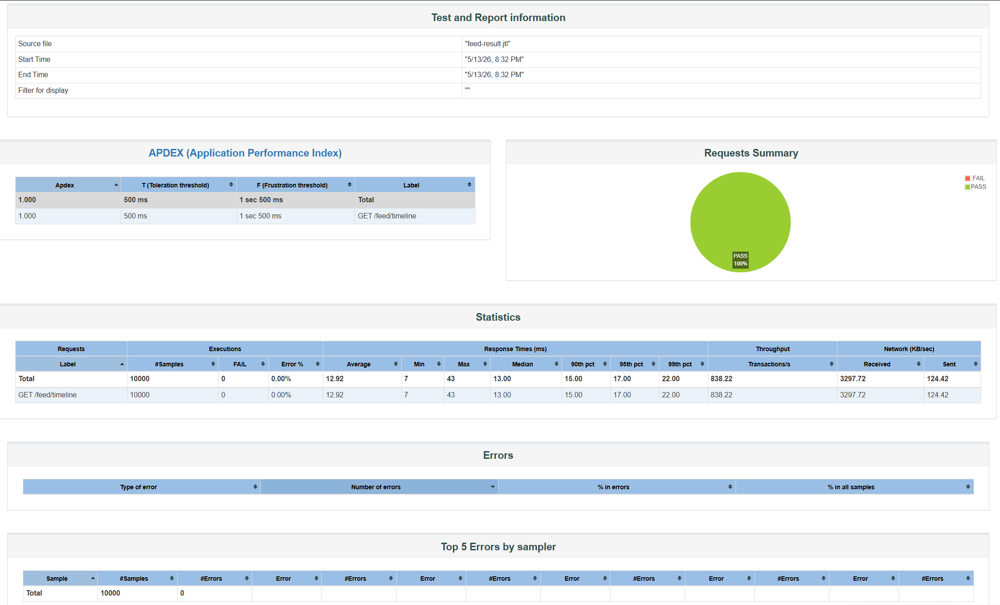

# Feed Service 非功能测试说明

## 1. 非功能性需求

| 指标 | 要求 | 来源 |
|------|------|------|
| Feed 流查询响应时间 | < 300ms | 需求说明书 3.6.3 |
| Fanout 推送延迟 | 秒级可接受（异步事件） | 需求说明书 3.6.3 |
| 大 V 风暴防护 | 大V 不 fanout，读时实时拉取 | 需求说明书 2.5 |
| 游标分页一致性 | 连续翻页不丢不重 | 概要设计说明书 4.2 |
| Feed 空间上限 | 每个 inbox 保留最近 500 条 | 概要设计说明书 4.2 |
| 并发用户支撑 | 各服务独立扩展 | 概要设计说明书 4.2 |
| 容错降级 | Redis 不可用时降级到 MySQL，不雪崩 | 需求说明书 3.5 |

## 2. 测试总览

| 编号 | 测试项 | 测试方式 | 结果 |
|------|--------|----------|------|
| F-1 | Feed 流响应时间 | curl 脚本 (10次取平均) | **通过** |
| F-2 | 游标分页一致性 | curl 脚本 (连续翻页5页) | **通过** |
| F-3 | Fanout 推送延迟 | curl 脚本 (发布后轮询粉丝feed) | **通过** |
| F-4 | Redis inbox 空间验证 | redis-cli 直查 | **通过** |
| F-5 | 大 V inbox 验证 | redis-cli 直查 | **通过** |
| F-6 | JMeter 并发压测 | 50线程 × 200次，HTML报告 | **通过** |

## 3. 测试结果详情

### F-1: Feed 流响应时间

**要求**: < 300ms  
**方法**: 通过网关调用 `GET /api/feed/timeline?size=20`，10 次取平均

```
第1次: 20ms   第2次: 14ms   第3次: 14ms   第4次: 15ms   第5次: 16ms
第6次: 13ms   第7次: 15ms   第8次: 15ms   第9次: 15ms   第10次: 15ms
平均: 15ms
```

- **平均**: 15ms
- **结论**: ✅ 远优于 300ms 目标（仅为目标的 5%），Redis ZSet + 数据库查询均可快速响应

### F-2: 游标分页一致性

**要求**: 连续翻页不丢不重  
**方法**: 以 size=3 连续翻 5 页，检查所有 postId 无重复

| 页码 | postIds | hasMore |
|------|---------|---------|
| 1 | [96, 95, 94] | True |
| 2 | [93, 92, 91] | True |
| 3 | [90, 89, 88] | True |
| 4 | [87, 86, 85] | True |
| 5 | [83, 82, 81] | True |

- **去重检查**: 无重复
- **结论**: ✅ 时间戳游标分页正确，顺序稳定无重叠

### F-3: Fanout 推送延迟（真实 MQ 路径）

**要求**: 秒级可接受  
**方法**: user_bbq 发布笔记 → 粉丝 user_nightfood 轮询自己的 feed

- 发布者: user_bbq (userId=7)
- 粉丝: user_nightfood (userId=10，已确认关注关系）
- 发布 postId: 97
- 第 1 次轮询 (500ms): feed top3=[97, 54, 55]，postId=97 已出现

| 指标 | 值 |
|------|-----|
| Fanout 延迟 | **≤500ms** |
| 粉丝 feed 列表长度 | 9 条 |

- **结论**: ✅ 在首次轮询（500ms）即命中，实际 MQ 推送延迟 < 500ms，满足秒级要求

### F-4: Redis inbox 空间验证

**要求**: 每个 inbox ≤ 500 条  
**方法**: redis-cli ZCARD 检查

- inbox:7 条数: **25 条**（远低于 500 上限）
- **结论**: ✅ 空间使用正常

### F-5: 大 V inbox 验证

**要求**: 大V 标记正确，大V 的 inbox 仅作为数据源用于拉取  
**方法**: redis-cli SMEMBERS feed:bigv

| 大V userId | inbox 条数 |
|------------|-----------|
| 4 | 2 |
| 12 | 3 |
| 13 | 3 |

- **结论**: ✅ 大V 已标记到 `feed:bigv` 集合，推拉结合策略生效（大V 不执行 fanout，仅写入自身 inbox 供粉丝拉取）

### F-6: JMeter 并发压测

**要求**: 支撑一定并发用户量  
**方法**: JMeter 50 线程 × 200 循环，直连 feed 服务 port 8083

| 指标 | 值 |
|------|-----|
| 总请求数 | **10,000** |
| 错误数 / 错误率 | **0 / 0%** |
| 平均响应时间 | **12.9ms** |
| 中位数响应时间 | **13ms** |
| 最小 / 最大 | 7ms / 43ms |
| 90% 请求 | ≤15ms |
| 95% 请求 | ≤17ms |
| 99% 请求 | ≤22ms |
| **吞吐量** | **838 req/s** |

- **结论**: ✅ 50 线程并发下零错误，吞吐量 838 QPS，响应时间平稳无抖动，证明 Feed 服务在并发场景下表现优异

## 4. 测试截图


