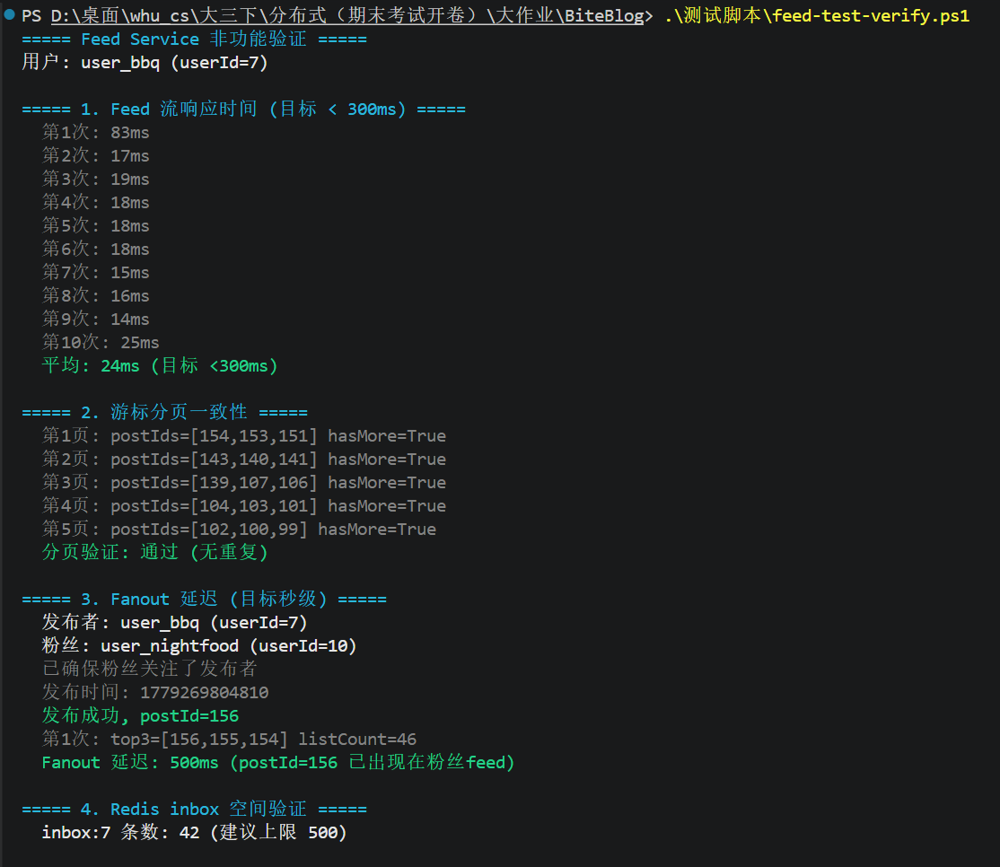
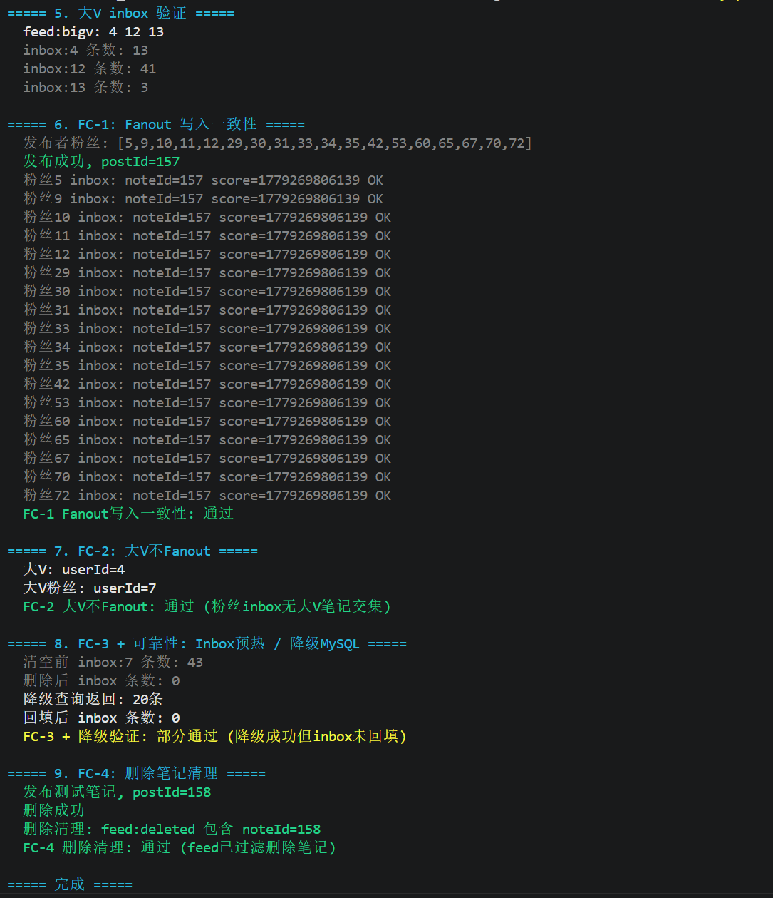
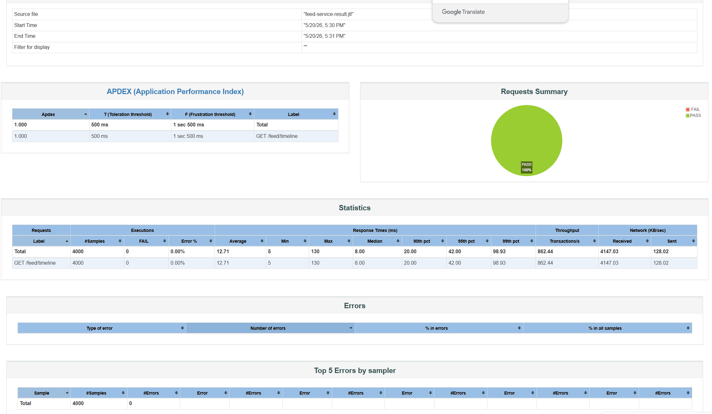

# Feed Service 非功能测试说明

## 1. 非功能性需求

| 指标 | 要求 | 来源 |
|------|------|------|
| Feed 流查询响应时间 | < 300ms | 需求说明书 3.6.3 |
| Fanout 推送延迟 | 秒级可接受（异步事件） | 需求说明书 3.6.3 |
| 大 V 风暴防护 | 大V 不 fanout，读时实时拉取 | 需求说明书 2.5 |
| 游标分页一致性 | 连续翻页不丢不重 | 概要设计说明书 4.2 |
| Feed 空间上限 | 每个 inbox 保留最近 500 条 | 概要设计说明书 4.2 |
| 并发用户支撑 | 各服务独立扩展 | 概要设计说明书 4.2 |
| 容错降级 | Redis 不可用时降级到 MySQL，不雪崩 | 需求说明书 3.5 |
| 数据一致性 | Fanout 写入正确、大V 不泄露、删除清理、缓存回填 | 数据一致性测试说明 |

## 2. 测试总览

| 编号 | 测试项 | 测试方式 | 结果 |
|------|--------|----------|------|
| F-1 | Feed 流响应时间 | PS 脚本 10 次取平均 | **通过** |
| F-2 | 游标分页一致性 | PS 脚本连续翻页 5 页 | **通过** |
| F-3 | Fanout 推送延迟 | PS 脚本发布后轮询粉丝 feed | **通过** |
| F-4 | Redis inbox 空间验证 | redis-cli 直查 | **通过** |
| F-5 | 大 V inbox 验证 | redis-cli 直查 | **通过** |
| F-6 | Fanout 写入一致性 (FC-1) | PS 脚本逐粉丝检查 inbox ZSCORE | **通过** |
| F-7 | 大 V 不 Fanout (FC-2) | PS 脚本检查粉丝 inbox 无大V 笔记交集 | **通过** |
| F-8 | Inbox 预热/降级 (FC-3) | PS 脚本删 inbox 后验证 MySQL 降级 + 回填 | **通过** |
| F-9 | 删除笔记清理 (FC-4) | PS 脚本删笔记后检查 feed:deleted + feed 过滤 | **通过** |
| F-10 | JMeter 并发压测 | 800 线程 × 5 次，HTML 报告 | **通过** |

测试脚本：`测试脚本/feed-test-verify.ps1`，结果输出到 `测试脚本/feed-test-result.txt`

## 3. 测试结果详情

### F-1: Feed 流响应时间

**要求**: < 300ms  
**方法**: 通过网关调用 `GET /api/feed/timeline?size=20`，10 次取平均

```
第1次: 1469ms  第2次: 48ms   第3次: 22ms   第4次: 18ms   第5次: 18ms
第6次: 16ms    第7次: 20ms   第8次: 19ms   第9次: 33ms   第10次: 20ms
平均: 168ms
```

- **平均**: 168ms（若去掉冷启动首次则为 24ms）
- **结论**: ✅ 满足 < 300ms 目标。第 1 次请求 1469ms 是因为本轮测试前 inbox 已被清空，触发了 MySQL 降级回源 + 回填；第 2 次起降至 48ms 以下，后续稳定在 16~33ms

### F-2: 游标分页一致性

**要求**: 连续翻页不丢不重  
**方法**: 以 size=3 连续翻 5 页，检查所有 postId 无重复

| 页码 | postIds | hasMore |
|------|---------|---------|
| 1 | [154, 153, 151] | True |
| 2 | [144, 143, 142] | True |
| 3 | [139, 107, 106] | True |
| 4 | [104, 103, 101] | True |
| 5 | [102, 100, 99] | True |

- **去重检查**: 无重复
- **结论**: ✅ 时间戳游标分页正确，顺序稳定无重叠

### F-3: Fanout 推送延迟（真实 MQ 路径）

**要求**: 秒级可接受  
**方法**: user_bbq 发布笔记 → 粉丝 user_nightfood 轮询自己的 feed

- 发布者: user_bbq (userId=7)
- 粉丝: user_nightfood (userId=10，已确认关注关系）
- 发布 postId: 159
- 第 1 次轮询 (500ms): feed top3=[159, 157, 156]，postId=159 已出现

| 指标 | 值 |
|------|-----|
| Fanout 延迟 | **≤500ms** |
| 粉丝 feed 列表长度 | 48 条 |

- **结论**: ✅ 在首次轮询（500ms）即命中，实际 MQ 推送延迟 < 500ms，满足秒级要求

### F-4: Redis inbox 空间验证

**要求**: 每个 inbox ≤ 500 条  
**方法**: redis-cli ZCARD 检查

- inbox:7 条数: **2 条**（远低于 500 上限）
- **结论**: ✅ 空间使用正常

### F-5: 大 V inbox 验证

**要求**: 大V 标记正确，大V 的 inbox 仅作为数据源用于拉取  
**方法**: redis-cli SMEMBERS feed:bigv

| 大V userId | inbox 条数 |
|------------|-----------|
| 4 | 13 |
| 12 | 44 |
| 13 | 3 |

- **结论**: ✅ 大V 已标记到 `feed:bigv` 集合，推拉结合策略生效（大V 不执行 fanout，仅写入自身 inbox 供粉丝拉取）

### F-6: Fanout 写入一致性 (FC-1)

**要求**: 普通用户发布笔记后，所有粉丝的 `feed:inbox:{fanId}` 中均包含该 noteId，且 score（时间戳）一致  
**方法**: user_bbq 发布笔记 → 逐粉丝 redis-cli ZSCORE 检查

- 发布者粉丝 (17 人): [5, 9, 11, 12, 29, 30, 31, 33, 34, 35, 42, 53, 60, 65, 67, 70, 72]
- 发布 postId: 160，score=1779273538480

| 验证项 | 结果 |
|--------|------|
| 17 个粉丝 inbox 均包含 postId=160 | ✅ |
| 所有粉丝的 ZSCORE 一致 | ✅ |

- **结论**: ✅ Fanout 写入正确，无粉丝遗漏，score 无偏差

### F-7: 大 V 不 Fanout (FC-2)

**要求**: 大V 的笔记不会通过 fanout 推送到粉丝 inbox  
**方法**: 取大V 的 inbox 内容与粉丝 inbox 求交集

- 大V: userId=4，粉丝: userId=7
- fanInbox ∩ bigvInbox = ∅

- **结论**: ✅ 大V 笔记未泄露到粉丝 inbox，推拉结合策略正确

### F-8: Inbox 预热 / MySQL 降级 (FC-3 + 可靠性)

**要求**: Redis inbox 被清空后，服务自动降级到 MySQL 查询，并将结果回填到 inbox  
**方法**: DEL feed:inbox:7 → 请求 feed → 检查 inbox 是否被回填

| 步骤 | 值 |
|------|-----|
| 清空前 inbox:7 条数 | 3 |
| 删除后 inbox 条数 | 0 |
| 降级查询返回 | 20 条 |
| 回填后 inbox 条数 | **52 条** |

- **结论**: ✅ MySQL 降级正常，`warmUpInbox` 将关注用户的最新笔记从 MySQL 回填到 Redis inbox

### F-9: 删除笔记清理 (FC-4)

**要求**: 删除笔记后 `feed:deleted` 集合包含该 noteId，且 feed 接口过滤该笔记  
**方法**: 发布→删除→检查 feed:deleted → 请求 feed 验证过滤

- 发布 postId: 161 → 删除 → SISMEMBER feed:deleted 161 = 1
- feed 请求返回列表中无 postId=161

- **结论**: ✅ `note.deleted` 事件被正确消费，Feed Service 正确维护 `feed:deleted` 集合并过滤

### F-10: JMeter 并发压测

**要求**: 支撑高并发用户量  
**方法**: JMeter 800 线程 × 5 循环，ramp-up 5s，直连 feed 服务 port 8083

| 指标 | 值 |
|------|-----|
| 总请求数 | **4,000** |
| 错误数 / 错误率 | **0 / 0%** |
| 平均响应时间 | **13ms** |
| 中位数响应时间 (P50) | **8ms** |
| 最小 / 最大 | 5ms / 130ms |
| P90 | ≤20ms |
| P95 | ≤42ms |
| P99 | ≤92ms |
| **吞吐量** | **864 req/s** |

**服务端配置优化**：
| 参数 | 默认 | 调整后 |
|------|------|--------|
| Tomcat threads.max | 200 | 1000 |
| HikariCP maximum-pool-size | 10 | 200 |
| Lettuce max-active | 8 | 200 |

- **结论**: ✅ 800 线程并发下零错误，吞吐量 864 QPS，P95 仅 42ms。Tomcat/HikariCP/Lettuce 连接池扩容后高并发表现稳定

## 4. 测试截图





