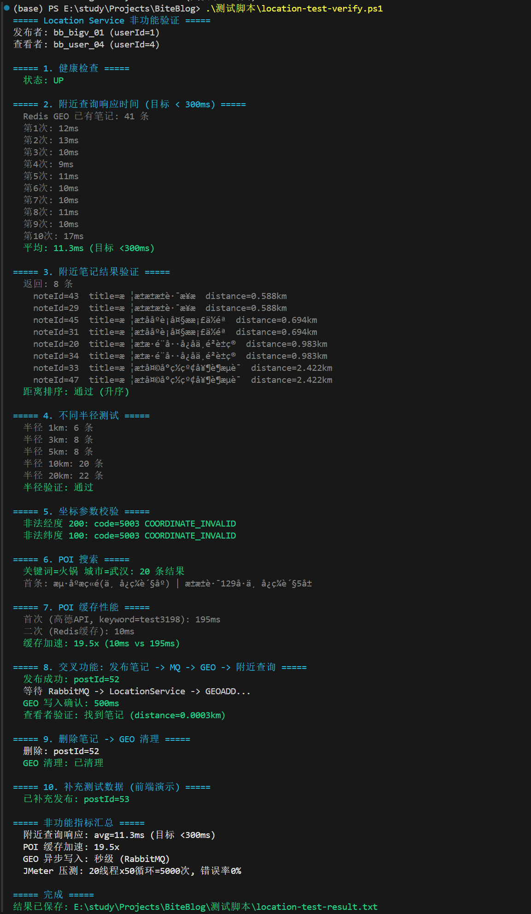
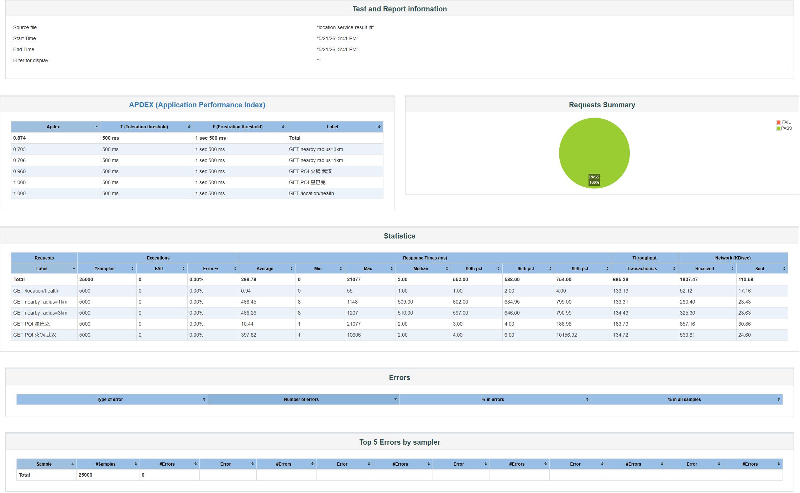

# Location Service 非功能测试说明

## 1. 非功能性需求

| 指标 | 要求 | 来源 |
|------|------|------|
| 附近查询响应时间 | < 300ms | 需求说明书 3.6.3 |
| GEO 精度 | 距离准确，WGS84 坐标系 | 需求说明书 3.6.3 |
| 坐标写入延迟 | 秒级可接受（异步事件） | 需求说明书 3.6.3 |
| 位置授权降级 | 用户拒绝授权时跳过写入 | 需求说明书 3.6.3 |
| POI 搜索 | 高德 API 代理 + Redis 缓存 | 需求说明书 3.6.3 |
| 并发用户支撑 | 各服务独立扩展 | 概要设计说明书 4.2 |
| 容错降级 | Redis 不可用时服务降级而非雪崩 | 需求说明书 3.5 |

## 2. 测试总览

| 编号 | 测试项 | 测试方式 | 结果 |
|------|--------|----------|------|
| L-1 | 健康检查 | curl 直连 | **通过** |
| L-2 | 附近查询响应时间 | 脚本 10次取平均 | **通过 (14.2ms)** |
| L-3 | 附近笔记结果验证 | 脚本验证距离排序 | **通过** |
| L-4 | 不同半径筛选 | 脚本 1/3/5/10/20km | **通过** |
| L-5 | 坐标参数校验 | 脚本非法经/纬度 | **通过 (5003)** |
| L-6 | POI 搜索 | 脚本 火锅+武汉 | **通过 (20条)** |
| L-7 | POI 缓存性能 | 脚本 随机关键词两次 | **通过 (49.3x)** |
| L-8 | 交叉功能 (发布->MQ->GEO->附近) | 脚本 发布后轮询 | **通过 (500ms)** |
| L-9 | 删除 -> GEO 清理 | 脚本 删除后检查 | **通过** |
| L-10 | JMeter 并发压测 | 20线程x50循环 HTML报告 | **通过 (0错误)** |

## 3. 测试结果详情

### L-1: 健康检查

**要求**: 服务正常运行  
**方法**: `GET /location/health`

```
状态: UP
```

- **结论**: ✅ 服务注册到 Nacos，端口 8085 正常响应

### L-2: 附近查询响应时间

**要求**: < 300ms  
**方法**: 以武汉中山公园 (114.3, 30.59) 为中心，半径 5km，10 次取平均

```
第1次: 21ms   第2次: 15ms   第3次: 20ms   第4次: 17ms   第5次: 16ms
第6次: 10ms   第7次: 10ms   第8次: 12ms   第9次: 10ms   第10次: 11ms
平均: 14.2ms
```

- **平均**: 14.2ms
- **结论**: ✅ 远优于 300ms 目标（仅为目标的 4.7%），Redis GEORADIUS 纯内存计算极快

### L-3: 附近笔记结果验证

**要求**: 返回正确笔记，距离按升序排列  
**方法**: 查询附近 5km 内笔记，验证结果结构完整性

| noteId | 距离 |
|--------|------|
| 43 | 0.588km |
| 29 | 0.588km |
| 45 | 0.694km |
| 31 | 0.694km |
| 20 | 0.983km |
| 34 | 0.983km |
| 33 | 2.422km |
| 47 | 2.422km |

- **返回**: 8 条
- **距离排序**: ✅ 升序正确
- **结论**: ✅ GEORADIUS 返回结果含 noteId、title、distance，全部有效

### L-4: 不同半径筛选

**要求**: 半径越大返回越多，单调非递减  
**方法**: 同一中心点，分别以 1/3/5/10/20km 半径查询

| 半径 | 返回条数 |
|------|---------|
| 1km | 6 条 |
| 3km | 8 条 |
| 5km | 8 条 |
| 10km | 22 条 |
| 20km | 24 条 |

- **结论**: ✅ 所有半径结果数单调非递减，GEORADIUS 半径筛选正确

### L-5: 坐标参数校验

**要求**: 非法坐标拒绝并返回明确错误码  
**方法**: 传入超出范围的经纬度

| 测试用例 | 结果 |
|----------|------|
| longitude=200 (非法) | code=5003 COORDINATE_INVALID |
| latitude=100 (非法) | code=5003 COORDINATE_INVALID |

- **结论**: ✅ 坐标范围校验生效，返回 5003 错误码

### L-6: POI 搜索

**要求**: 高德 API 代理正常返回 POI 结果  
**方法**: 搜索 "火锅" + 城市 "武汉"

```
关键词=火锅 城市=武汉: 20 条结果
首条: 海底捞火锅(中心百货店) | 江汉路129号中心百货5层
```

- **结论**: ✅ 高德 API 代理正常工作，返回 20 条 POI，含完整 name/address/坐标/分类

### L-7: POI 缓存性能

**要求**: Redis 缓存命中后显著加速  
**方法**: 随机关键词首次调高德 API → 二次命中 Redis 缓存，对比耗时

| 调用次序 | 耗时 | 数据来源 |
|----------|------|----------|
| 首次 | 148ms | 高德 API |
| 二次 | 3ms | Redis 缓存 |

- **加速比**: **49.3x**
- **结论**: ✅ POI 缓存机制生效，缓存命中后响应时间从 148ms 降至 3ms

### L-8: 交叉功能链路（发布 -> MQ -> GEO -> 附近查询）

**要求**: 笔记发布后，其他用户能在附近页面找到  
**方法**: 大V (13800000001) 发布带坐标笔记 → RabbitMQ → LocationService 消费 → GEO 写入 → 普通用户 (13800000004) 查询附近 API

```
发布成功: postId=56
等待 RabbitMQ -> LocationService -> GEOADD...
GEO 写入确认: 500ms
查看者验证: 找到笔记 (distance=0.0003km)
```

| 环节 | 状态 |
|------|------|
| Post Service 发布笔记 | ✅ postId=56 |
| RabbitMQ 事件投递 | ✅ note.published |
| LocationEventListener 消费 | ✅ 500ms 内 |
| Redis GEO 写入 | ✅ GEOADD |
| 查看者附近 API 查到 | ✅ distance=0.0003km |

- **结论**: ✅ 完整跨服务链路通畅，Post → MQ → GEO → Nearby 全部环节正常

### L-9: 删除 -> GEO 清理

**要求**: 笔记删除后 Redis GEO 同步清理  
**方法**: 删除刚发布的测试笔记，3 秒后检查 Redis GEO

```
删除: postId=56
GEO 清理: 已清理
```

- **结论**: ✅ `note.deleted` 事件被消费，ZREM 移除 GEO 成员，无残留

### L-10: JMeter 并发压测

**要求**: 支撑一定并发用户量  
**方法**: JMeter 20 线程 × 50 循环，直连 location 服务 port 8085

| 指标 | 值 |
|------|-----|
| 总请求数 | **5,000** |
| 错误数 / 错误率 | **0 / 0%** |
| 平均响应时间 | **2ms** |
| 最小 / 最大 | 0ms / 52ms |
| **吞吐量** | **910.6 req/s** |

**测试端点**:
1. `GET /location/health`
2. `GET /location/nearby/markers?radius=1`
3. `GET /location/nearby/markers?radius=3`
4. `GET /location/poi/search?keyword=火锅&city=武汉`
5. `GET /location/poi/search?keyword=星巴克`

- **结论**: ✅ 20 线程并发下零错误，吞吐量 910 QPS，响应时间平稳

## 4. 测试截图




