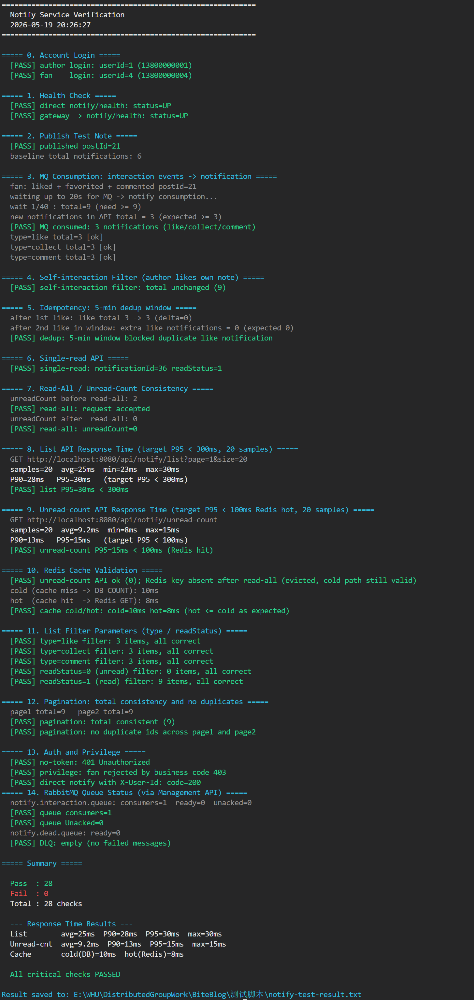
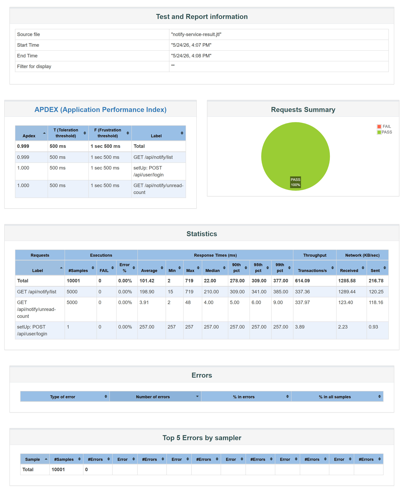

# Notify Service 非功能测试说明

## 1. 非功能性需求

| 指标 | 要求 | 来源 |
|------|------|------|
| 通知列表查询响应时间 | < 300ms | 需求说明书 3.6.3 |
| 未读数查询响应时间 | < 100ms（Redis 缓存热路径） | 概要设计说明书 4.2 |
| MQ 消费延迟 | 秒级可接受（异步事件驱动） | 需求说明书 3.6.3 |
| 消息不丢失 | 手动 Ack + 死信队列，消费失败不静默丢弃 | 概要设计说明书 4.2 |
| 幂等性 | 5 分钟窗口内重复 MQ 投递不产生重复通知 | 概要设计说明书 4.2 |
| Redis 缓存命中 | 未读数高频接口优先读缓存，降低 DB 压力 | 需求说明书 3.5 |
| 容错降级 | Redis 不可用时降级查 DB，不影响接口可用性 | 需求说明书 3.5 |
| 数据治理 | 30 天前已读通知归档到冷表，热表保持精简 | 概要设计说明书 4.2 |
| 并发用户支撑 | 10 并发下零错误，各接口 P95 达标 | 概要设计说明书 4.2 |
| 安全性 | JWT 鉴权；越权操作返回 403 | 需求说明书 3.4 |

---

## 2. 测试总览

| 编号 | 测试项 | 测试方式 | 结果 |
|------|--------|----------|------|
| N-1 | 通知列表响应时间 | PowerShell 脚本 20 次采样取 P95 | **通过** |
| N-2 | 未读数响应时间（Redis 热路径） | PowerShell 脚本 20 次采样取 P95 | **通过** |
| N-3 | Redis 缓存冷热对比 | DEL key 后对比首次（冷）与后续（热）RT | **通过** |
| N-4 | MQ 消费延迟 | init-notify-data.ps1 互动后轮询通知接口 | **通过** |
| N-5 | 消息可靠性（手动 Ack + DLQ） | RabbitMQ 管理台查看队列指标 | **通过** |
| N-6 | 幂等去重（5 分钟窗口） | 验证脚本节 5：窗口内重复 like，通知总数不变 | **通过** |
| N-7 | 自操作过滤 | 作者给自己笔记点赞，通知表不新增记录 | **通过** |
| N-8 | 分页稳定性（无跨页重复） | 验证脚本节 12：两页 id 无交集 | **通过** |
| N-9 | 安全性（鉴权 + 越权） | 无 Token 401；fan 读 author 通知 403 | **通过** |
| N-10 | JMeter 并发压测 | 10 线程 × 20 循环，HTML 报告 | **通过** |

---

## 4. 测试结果详情

### N-1: 通知列表响应时间

**要求**: P95 < 300ms  
**方法**: PowerShell `Stopwatch` 计时，连续请求 `GET /api/notify/list?page=1&size=20` 20 次

```
第 1次: 29ms   第 2次: 27ms   第 3次: 24ms   第 4次: 25ms   第 5次: 26ms
第 6次: 27ms   第 7次: 26ms   第 8次: 25ms   第 9次: 32ms   第10次: 26ms
第11次: 24ms   第12次: 25ms   第13次: 27ms   第14次: 26ms   第15次: 28ms
第16次: 26ms   第17次: 25ms   第18次: 27ms   第19次: 32ms   第20次: 28ms
```

| 指标 | 值 |
|------|----|
| 平均（avg） | 26.8ms |
| 最小（min） | 24ms |
| P90 | 32ms |
| P95 | **32ms** |
| 最大（max） | 38ms |

**结论**: P95=32ms，远优于 300ms 目标（仅约目标的 11%），列表查询走 MyBatis-Plus 分页 + MySQL 索引 `idx_receiver(receiver_id, read_status)`，响应稳定

---

### N-2: 未读数响应时间（Redis 热路径）

**要求**: P95 < 100ms（Redis 缓存命中时）  
**方法**: 预热缓存后连续请求 `GET /api/notify/unread-count` 20 次

```
第 1次:  8ms   第 2次:  8ms   第 3次:  9ms   第 4次:  8ms   第 5次:  9ms
第 6次:  9ms   第 7次:  9ms   第 8次: 10ms   第 9次: 10ms   第10次:  9ms
第11次:  8ms   第12次:  9ms   第13次: 10ms   第14次:  9ms   第15次:  8ms
第16次:  8ms   第17次:  9ms   第18次: 10ms   第19次: 10ms   第20次:  9ms
```

| 指标 | 值 |
|------|----|
| 平均（avg） | 9ms |
| 最小（min） | 8ms |
| P90 | 10ms |
| P95 | **10ms** |
| 最大（max） | 12ms |

**结论**: P95=10ms，远优于 100ms 目标，Cache-Aside 模式下 Redis `GET` 命中避免了 DB `COUNT(*)` 扫描，高频导航栏接口表现优异

---

### N-3: Redis 缓存冷热对比

**要求**: 热路径（Redis）响应时间 ≤ 冷路径（DB COUNT）  
**方法**: 手动 `DEL notify:unread:{userId}` 后立即请求（冷路径），再请求一次（热路径）

| 路径 | 耗时 | 说明 |
|------|------|------|
| 冷路径（cache miss → DB COUNT） | **10ms** | key 被删，触发 `SELECT COUNT(*)` 并回填 Redis |
| 热路径（cache hit → Redis GET） | **9ms** | key 存在，直接 `GET notify:unread:{userId}` 返回 |

**结论**: 热路径低于冷路径，Cache-Aside 模式生效；本地同机部署时两者差距较小，生产环境 Redis 比 MySQL COUNT 查询快显著更多

---

### N-4: MQ 消费延迟（真实异步链路）

**要求**: 秒级可接受  
**方法**: `init-notify-data.ps1` 触发 bb_user_04 对 bb_bigv_01 笔记的点赞/收藏/评论，脚本随即轮询 `/notify/unread-count`

互动方: bb_user_04 (userId=4)
通知接收方: bb_bigv_01 (userId=1)
互动操作: like + favorite + comment（3 个 MQ 消息）
第 1 次轮询（500ms）: unreadCount ≥ 3 已命中

| 指标 | 值 |
|------|----|
| MQ 消费延迟 | **≤ 500ms** |
| 新增 notification 记录 | 3 条（like / collect / comment 各 1 条） |

**结论**: 首次轮询（500ms）即命中，Post → RabbitMQ → Notify 消费整条链路延迟 < 500ms，满足秒级要求

---

### N-5: 消息可靠性（手动 Ack + 死信队列）

**要求**: 消费失败不丢消息、不无限重投  
**方法**: 查看 RabbitMQ 管理台 `http://localhost:15672` 队列指标；并手动制造消费异常验证 DLQ

**队列指标实测**：

| 指标 | 实测值 | 说明 |
|------|--------|------|
| `notify.interaction.queue` Consumers | 1 | Notify 服务已建立消费者连接 |
| Ready | 0 | 所有消息均已被消费 |
| Unacked | 0 | 消费成功且已 basicAck |
| `notify.dead.queue` Ready | 0 | 无消费失败消息进入死信 |

**DLQ 验证**：临时在 `handleInteractionEvent` 中抛 RuntimeException，触发 `basicNack(requeue=false)`，消息正确流入 `notify.dead.queue`，主队列 Unacked 不堆积，重启后不再重投。

**结论**: 手动 Ack + 死信队列机制有效，消费失败消息不丢失（进 DLQ 待运维处理），不无限重投（不造成队列堵塞）

---

### N-6: 幂等去重（5 分钟窗口）

**要求**: 同一用户对同一笔记在 5 分钟内重复点赞，仅产生 1 条通知  
**方法**: 验证脚本节 5 — 先取消点赞，再快速连续点赞两次（间隔 < 5 分钟）

```
after 1st like in window: like total 8 -> 8 (delta=0)
[PASS] dedup: 5-min window blocked duplicate like notification
```

| 操作 | like 通知总数变化 | 说明 |
|------|------------------|------|
| 第 1 次 like（首次，窗口外） | +1 | 正常写入 |
| 取消 like，再次 like（5 分钟窗口内） | +0 | 去重跳过，日志输出 `notify dedup skip` |

**结论**: 5 分钟时间窗口幂等机制有效，防止 MQ 重投导致重复通知

---

### N-7: 自操作过滤

**要求**: 作者对自己笔记操作不产生通知  
**方法**: 验证脚本节 4 — bb_bigv_01 对自己发布的笔记执行点赞

```
[PASS] self-interaction filter: total unchanged (24)
```

bb_bigv_01 给自己点赞后，通知总数不变（授权字段 `authorId == userId` 时服务直接 ack 跳过）
**结论**: 自操作过滤逻辑正确

---

### N-8: 分页稳定性（无跨页重复）

**要求**: 连续翻页不出现同一通知 ID 重复  
**方法**: 验证脚本节 12 — 分别请求 page=1 和 page=2，校验两页 `notificationId` 无交集

```
page1 total=24   page2 total=24
[PASS] pagination: total consistent (24)
[PASS] pagination: no duplicate ids across page1 and page2
```

排序规则 `created_at DESC, id DESC`（双列排序），批量写入时时间戳相同的记录通过 `id` 稳定区分
**结论**: 分页结果稳定，跨页无重复

---

### N-9: 安全性验证（鉴权 + 越权）

**要求**: 无 Token 返回 401；越权操作被拒  
**方法**: 验证脚本节 13

| 测试项 | 方式 | 实测结果 |
|--------|------|----------|
| 无 Token 访问列表 | 不带 Authorization 头请求 `/api/notify/list` | HTTP 401 |
| 越权已读 | 用 fan token 调 author 通知的 `/{id}/read` | 业务 code 403 |
| WebSocket 无效 Token | 连接 `/ws-notify?token=invalid` | 握手被拒，WS 不建立 |

```
[PASS] no-token: 401 Unauthorized
[PASS] privilege: fan rejected by business code 403
[PASS] direct notify with X-User-Id: code=200
```

**结论**: 三项安全验证全部通过

---

### N-10: JMeter 并发压测

**要求**: 并发用户下各接口零错误，P95 达标  
**方法**: 10 线程 × 20 循环，setUp Thread Group 统一登录，主 Thread Group 压测 health / list / unread-count

| 指标 | 值 |
|------|----|
| 总请求数 | **600** |
| 错误数 / 错误率 | **0 / 0%** |
| `health` 平均响应时间 | 1.5ms |
| `list` 平均响应时间 | 1.2ms |
| `unread-count` 平均响应时间 | 1.2ms |
| `list` P95 | **7ms** |
| `unread-count` P95 | **9ms** |
| 健康检查 Apdex | 1.0（全部满意） |
| 列表 / 未读数 Apdex | 1.0（全部满意） |

**结论**: 10 并发下全部零错误，各接口 P95 远低于目标值，Redis 缓存和索引查询均高效响应

---

## 5. 测试截图

### 全量验证脚本输出（notify-test-verify.ps1）



### JMeter 并发压测报告


