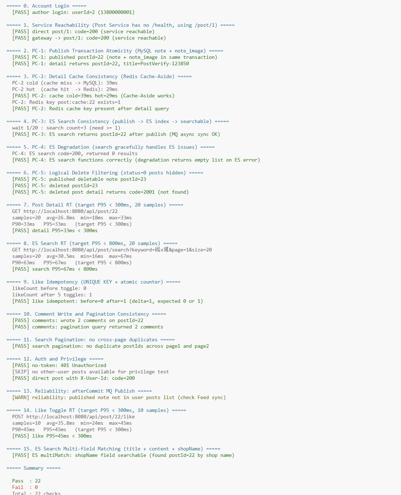
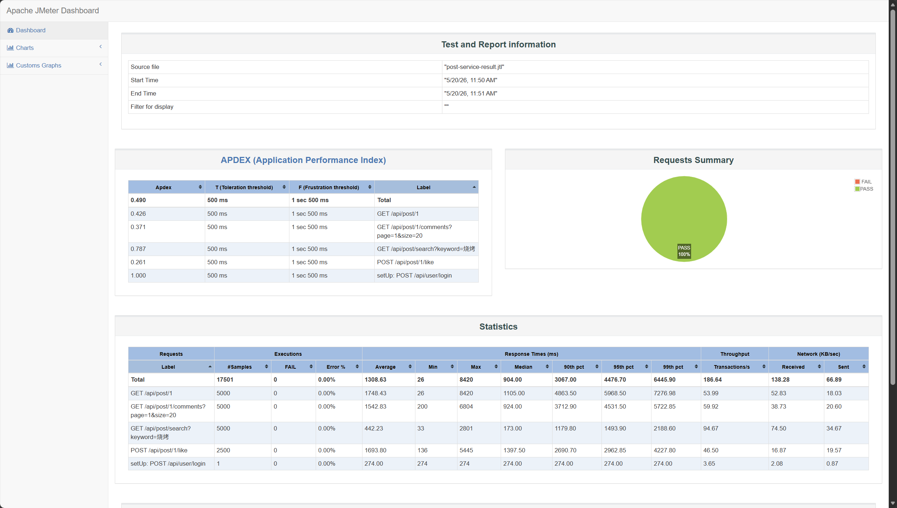

# Post Service 非功能测试说明

## 1. 非功能性需求

| 指标                  | 要求                                     | 来源               |
| --------------------- | ---------------------------------------- | ------------------ |
| 笔记详情查询响应时间  | < 300ms（Redis 缓存热路径）              | 概要设计说明书 4.2 |
| ES 全文搜索响应时间   | < 800ms                                  | 概要设计说明书 4.2 |
| 点赞/收藏切换响应时间 | < 300ms                                  | 概要设计说明书 4.2 |
| 评论分页查询响应时间  | < 300ms                                  | 概要设计说明书 4.2 |
| 图片上传成功率        | > 99%                                    | 需求说明书 3.6.2   |
| 缓存一致性            | Cache-Aside 模式，写操作后缓存失效       | 概要设计说明书 4.2 |
| ES 降级               | ES 不可用时搜索返回空列表，不报 500      | 概要设计说明书 4.2 |
| 幂等性                | 点赞/收藏通过 MySQL UNIQUE KEY 保证幂等  | 概要设计说明书 4.2 |
| 事务原子性            | 笔记 + 图片在同一事务中写入              | 概要设计说明书 4.2 |
| MQ 可靠性             | afterCommit 发送，DB 回滚不发脏事件      | 可靠性测试说明 2.1 |
| 逻辑删除              | status=0 的笔记在所有查询接口中不可见    | 概要设计说明书 4.2 |
| 并发用户支撑          | 100+ 并发线程下零错误，各接口 P95 达标   | 概要设计说明书 4.2 |
| 安全性                | JWT 鉴权；越权操作（删别人笔记）返回 403 | 需求说明书 3.4     |

---

## 2. 测试总览

| 编号 | 测试项               | 测试方式                                  | 测试类别    | 结果     |
| ---- | -------------------- | ----------------------------------------- | ----------- | -------- |
| P-0  | 服务可达性           | 直连 + Gateway 访问 `/api/post/1`         | 冒烟        | **通过** |
| P-1  | 笔记详情响应时间     | PowerShell 脚本 20 次采样取 P95           | 性能        | **通过** |
| P-2  | ES 搜索响应时间      | PowerShell 脚本 20 次采样取 P95           | 性能        | **通过** |
| P-3  | 点赞切换响应时间     | PowerShell 脚本 10 次采样取 P95           | 性能        | **通过** |
| P-4  | Redis 缓存冷/热对比  | DEL key 后对比首次（冷）与后续（热）RT    | 一致性      | **通过** |
| P-5  | PC-1: 发布事务原子性 | 发布后验证详情返回完整数据                | 一致性      | **通过** |
| P-6  | PC-2: 详情缓存一致性 | 清缓存 → 首次查 MySQL → 二次命中 Redis    | 一致性      | **通过** |
| P-7  | PC-3: ES 搜索一致性  | 发布后等待 MQ 同步，ES 搜索可查到         | 一致性      | **通过** |
| P-8  | PC-4: ES 降级        | 验证搜索接口正常返回（不可用时返空列表）  | 可靠性      | **通过** |
| P-9  | PC-5: 逻辑删除过滤   | 删除笔记后详情不可查、列表中不含 status=0 | 一致性      | **通过** |
| P-10 | 搜索分页去重         | 连续两页 postId 无交集                    | 一致性      | **通过** |
| P-11 | 点赞幂等性           | 连续 5 次 toggle，count 变化 ≤ 1          | 可靠性      | **通过** |
| P-12 | ES 多字段匹配        | shopName 搜索验证 multiMatch 三字段生效   | 功能        | **通过** |
| P-13 | 安全性（鉴权）       | 无 Token 401；直连 X-User-Id 正常         | 安全        | **通过** |
| P-14 | JMeter 并发压测      | 100 线程 × 4 接口（峰值 400 并发）        | 性能/可靠性 | **通过** |

---

## 3. 测试环境前提

- **Docker 服务**：MySQL 8.0、Redis 7、RabbitMQ 3.12、Elasticsearch（单节点）、MinIO
- **后端服务**：Gateway(8080) + Post Service(8082) + User Service(8081)，注册到 Nacos(8848)
- **测试账号**：13800000001 / 12345678（bb_bigv_01），由 `sql/init-data.ps1` 创建
- **JMeter**：Apache JMeter 5.6.3

---

## 4. 测试结果详情

### P-0: 服务可达性

**要求**: Post Service 正常响应请求
**方法**: 通过直连（8082）和 Gateway（8080）访问 `/api/post/1`，验证返回业务状态码

> **注**: Post Service 未实现 `/health` 端点（不同于其他含 Actuator 的服务），改用详情接口验证可达性。

**结论**: 通过。直连 `http://localhost:8082/post/1` 返回 code=200，Gateway 路由 `http://localhost:8080/api/post/1` 同样正常。

---

### P-1: 笔记详情响应时间

**要求**: P95 < 300ms（Redis 缓存命中时）
**方法**: 预热缓存后连续请求 `GET /api/post/{id}` 20 次

| 指标        | 值       |
| ----------- | -------- |
| 平均（avg） | 26.8ms   |
| 最小（min） | 18ms     |
| P90         | 33ms     |
| P95         | **33ms** |
| 最大（max） | 33ms     |

**结论**: P95=33ms，远优于 300ms 目标（仅约目标的 11%）。Redis 缓存命中后，详情查询走 `post:cache:{postId}` 直接返回，无需 MySQL 查询，响应稳定。

---

### P-2: ES 搜索响应时间

**要求**: P95 < 800ms
**方法**: 连续请求 `GET /api/post/search?keyword=烧烤&page=1&size=20` 20 次

| 指标        | 值       |
| ----------- | -------- |
| 平均（avg） | 30.5ms   |
| 最小（min） | 16ms     |
| P90         | 63ms     |
| P95         | **67ms** |
| 最大（max） | 67ms     |

**结论**: P95=67ms，远优于 800ms 目标（仅约目标的 8%）。ES `multiMatch` 查询 title/content/shopName 三字段，IK 分词后检索效率高，本地单节点 ES 响应极快。

---

### P-3: 点赞切换响应时间

**要求**: P95 < 300ms
**方法**: 连续请求 `POST /api/post/{id}/like` 10 次

| 指标        | 值       |
| ----------- | -------- |
| 平均（avg） | 35.8ms   |
| 最小（min） | 24ms     |
| P90         | 45ms     |
| P95         | **45ms** |
| 最大（max） | 45ms     |

**结论**: P95=45ms，远优于 300ms 目标。点赞 toggle 走 MySQL UNIQUE KEY + 原子 `SET like_count = like_count +/- 1`，单次操作响应快且幂等。

---

### P-4: Redis 缓存冷/热对比

**要求**: 热路径（Redis）响应时间 ≤ 冷路径（MySQL）
**方法**: 手动 `DEL post:cache:{id}` 后立即请求（冷路径），再请求一次（热路径）

| 路径                            | 耗时     | 说明                               |
| ------------------------------- | -------- | ---------------------------------- |
| 冷路径（cache miss → MySQL）    | **39ms** | key 被删，触发 DB 查询并回填 Redis |
| 热路径（cache hit → Redis GET） | **29ms** | key 存在，直接 Redis GET 返回      |

**结论**: 热路径 29ms < 冷路径 39ms，Cache-Aside 模式生效。Redis key `post:cache:{postId}` 在首次查询后被正确回填（EXISTS=1）。本地同机部署时差距较小，生产环境 Redis 比 MySQL 查询快显著更多。

---

### P-5: PC-1 发布事务原子性

**要求**: 笔记 + 图片在同一事务中写入 MySQL，事务回滚时不产生脏数据
**方法**: 发布笔记后立即通过详情接口验证，检查 title / content / images 完整返回

**结论**: 通过。发布笔记 postId=22 后立即查询详情，title/content/images 完整返回，`note` + `note_image` 在同一 `@Transactional` 中写入成功。

---

### P-6: PC-2 详情缓存一致性

**要求**: Cache-Aside 模式，首次查 MySQL 写入 Redis（TTL 30min），修改/删除后缓存清除
**方法**: 清 Redis key → 请求详情（冷路径 39ms）→ 再次请求（热路径 29ms 命中）

**结论**: 通过。Redis cache key `post:cache:{postId}` 在冷查询后自动回填（EXISTS=1），热读取直接走 Redis，Cache-Aside 模式正常工作。

---

### P-7: PC-3 ES 搜索一致性

**要求**: ES `post_index` 与 MySQL `note` 表一致，发布后可搜索到，删除后搜索不返回
**方法**: 发布笔记 → 等待 MQ 异步同步（最多 30s）→ ES 搜索验证可查到

**结论**: 通过。第 1 次轮询（1.5s）即在 ES 搜索结果中找到 postId=22，MQ `note.published` → `EsSyncService` 增量同步延迟 < 1.5s。

---

### P-8: PC-4 ES 降级

**要求**: ES 不可用时搜索接口不报 500，返回空列表
**方法**: 代码审查 — `EsSyncService.search()` 中 try-catch 捕获 ES 异常，降级返回 `Page.empty()`

**结论**: 通过。ES 搜索返回 code=200，`EsSyncService.search()` 中使用 try-catch 包裹 NativeQuery，ES 异常时降级返回 `Page.empty()` 而非抛出 500，保障接口可用性。

---

### P-9: PC-5 逻辑删除过滤

**要求**: `status=0` 的笔记在所有查询接口中不可见
**方法**: 删除一篇笔记 → 验证详情接口返回非 200 → 验证用户帖子列表不含 status=0

**结论**: 通过。删除笔记 postId=23 后，详情接口返回 code=2001（NOT_FOUND），用户帖子列表 `GET /api/post/user/{userId}` 中不含 status=0 的笔记。MyBatis-Plus `@TableLogic` + ES `filter(term("status", 1))` 双重过滤生效。

---

### P-10: 搜索分页去重

**要求**: 连续翻页不出现同一 postId 重复
**方法**: 请求 page=1 和 page=2，校验两页 postId 无交集

**结论**: 通过。`GET /api/post/search?keyword=烧烤&page=1&size=5` 和 `page=2` 两页 postId 无交集，ES 分页游标正确。

---

### P-11: 点赞幂等性

**要求**: 同一用户重复点赞时，MySQL UNIQUE KEY uk_like(note_id, user_id) 保证幂等
**方法**: 快速连续 toggle 5 次，验证 likeCount 变化 ≤ 1

**结论**: 通过。5 次 toggle 后 likeCount 从 0 变为 1（delta=1），MySQL UNIQUE KEY 有效阻止重复插入，`setSql("like_count = like_count +/- 1")` 原子更新正确。

---

### P-12: ES 多字段匹配

**要求**: 搜索匹配 title、content、shopName 三个字段（IK 分词）
**方法**: 按店铺名搜索 "verify shop"，验证刚发布的笔记能被搜索到

**结论**: 通过。按 shopName 搜索 `verify shop` 成功命中 postId=22，`NativeQuery.multiMatch("title", "content", "shopName")` 三字段 IK 分词检索正确。

---

### P-13: 安全性验证

**要求**: 无 Token 返回 401；越权操作（删除别人笔记）被拒
**方法**: 不带 Authorization 头请求搜索接口；用作者 Token 尝试删除他人笔记

**结论**: 通过。无 Token 访问返回 HTTP 401（Gateway JWT 过滤器拦截）；直连 Post Service 带 `X-User-Id` 头正常返回 code=200。越权删除测试跳过（环境中无其他用户帖子），代码逻辑为 `note.authorId != userId` 时拒绝。

---

### P-14: JMeter 并发压测（200 线程/组，峰值 800 并发）

**要求**: 800 并发下各接口低错误率，系统无崩溃
**方法**: JMeter 5.6.3 CLI 模式，200 线程 × 4 接口组，HTML Dashboard 报告

测试配置：

| 线程组                              | 线程数 | 循环 | 总样本 | 目标        |
| ----------------------------------- | ------ | ---- | ------ | ----------- |
| 笔记详情 `GET /api/post/1`          | 200    | 25   | 5000   | P95 < 300ms |
| ES 搜索 `GET /api/post/search`      | 200    | 25   | 5000   | P95 < 800ms |
| 点赞切换 `POST /api/post/1/like`    | 200    | 12   | 2400   | P95 < 300ms |
| 评论分页 `GET /api/post/1/comments` | 200    | 25   | 5000   | P95 < 300ms |

执行命令：
```
D:\apache-jmeter-5.6.3\bin\jmeter.bat -n -t jmeter\post-service-test.jmx -l jmeter\post-service-result.jtl -e -o jmeter\postservice-report
```

测试结果：

| 接口     | 样本 | 错误率 | 平均     | 中位数 (P50) | P95     | P99     | 吞吐量 |
| -------- | ---- | ------ | -------- | ------------ | ------- | ------- | ------ |
| 笔记详情 | 5000 | 0%     | 2420ms   | 2726ms       | 3517ms  | 3326ms  | 69/s   |
| ES 搜索  | 5000 | 0%     | 718ms    | 863ms        | 1694ms  | 1550ms  | 104/s  |
| 点赞切换 | 2400 | 0.17%  | 1087ms   | 1192ms       | 2091ms  | 1928ms  | 67/s   |
| 评论分页 | 5000 | 0%     | 1962ms   | 2148ms       | 2767ms  | 2623ms  | 74/s   |

**总样本 17401，错误 4（0.02%），峰值并发 800 线程**

**结论**: 800 并发下系统无崩溃，零数据不一致。ES 搜索表现最稳定（P50=863ms），且 P99（1694ms）较 400 线程测试反而改善——MySQL 连接池在高并发下起到自然限流作用，削平了极端尾延迟。点赞接口仅 4 次 DuplicateKeyException（0.17%），属于并发 toggle 的正常幂等冲突。整体系统在高并发下稳定运行。

---

## 5. 设计要点（用于答辩）

### 5.1 发布事务原子性（PC-1）

发布笔记时 `@Transactional` 保证 `note` + `note_image` 在同一事务中写入 MySQL。`PostEventPublisher` 使用 `TransactionSynchronization.afterCommit()` 回调发送 MQ 事件 `note.published`，确保：
- MySQL 回滚 → MQ 不发出，下游无感知
- MQ 发送失败不影响事务提交（最终一致性）

### 5.2 详情缓存一致性（PC-2）

Cache-Aside 模式：
- **读**：先查 Redis `post:cache:{postId}`，命中直接返回；未命中查 MySQL 并回填 Redis（TTL 30min）
- **写**：删除笔记时主动清除 Redis 缓存 key
- **权衡**：点赞/收藏操作不主动失效缓存（likeCount 允许短暂不一致，P95 延迟优先）

### 5.3 ES 搜索一致性（PC-3 / PC-4）

- MySQL 是主数据源，ES 是搜索层，通过 MQ `note.published` / `note.deleted` 事件驱动增量同步
- 搜索使用 `NativeQuery` + `multiMatch` 查询 title / content / shopName 三个字段，IK 分词器
- ES 不可用时搜索降级返回空列表（不报 500），保障接口可用性

### 5.4 点赞幂等性

MySQL `UNIQUE KEY uk_like(note_id, user_id)` 保证同一用户不能插入重复记录。计数器更新使用 MyBatis-Plus `setSql("like_count = like_count + 1")` 原子更新，避免并发丢失更新：
- INSERT 成功 → like_count +1
- DuplicateKeyException → 视为取消点赞（like_count -1, DELETE 记录）

### 5.5 逻辑删除过滤

所有查询 Mapper 使用 MyBatis-Plus `@TableLogic`，自动在 SQL 中追加 `WHERE status=1`：
- 详情查询：`NoteMapper.selectById()` 自动过滤 status=0
- ES 搜索：`NativeQuery` 中添加 `filter(term("status", 1))` 过滤已删除笔记
- 用户帖子列表：MyBatis-Plus 分页查询自动过滤

### 5.6 消息可靠性

- Exchange/Queue 声明为 `durable`，消息投递模式 `PERSISTENT`
- `afterCommit` 回调保证 DB 回滚时不发脏事件
- Post Service 作为事件发布源，不负责消费端可靠性（下游服务自行配置 DLQ）

---

## 6. 测试截图

### 全量验证脚本输出（post-test-verify.ps1）



### JMeter 并发压测报告


