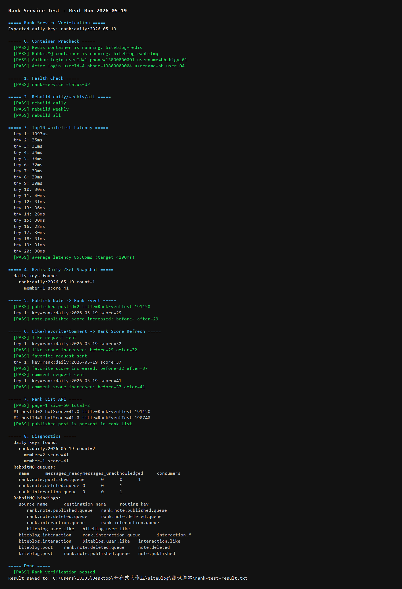
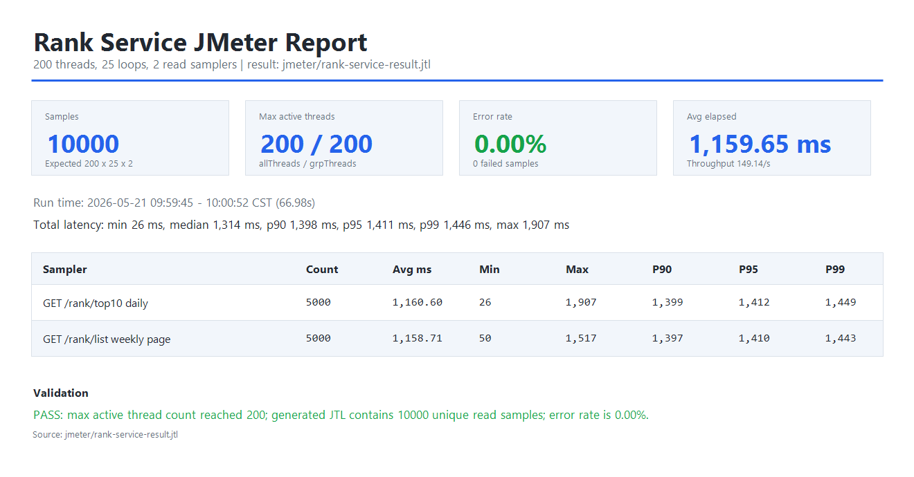

# Rank Service 非功能测试说明

## 1. 非功能性需求

| 类别 | 要求 | 实现/验证 |
|------|------|-----------|
| 并发 | 热榜接口在 100 线程以上并发访问下稳定返回、零错误，并记录真实并发响应时间 | Redis ZSet 读榜；`F-1` 为单请求基线，`F-2` 为 200 线程并发压测 |
| 一致性 | Redis 榜单缓存与 MySQL `note` 表、RabbitMQ 事件保持最终一致 | 对应 `数据一致性测试说明.md` 中 Rank `RC-1` ~ `RC-9`；`F-3` ~ `F-6` 已覆盖核心链路 |
| 可靠性 | Redis 缓存为空、异常或分数漂移时可恢复 | 对应 `可靠性测试说明.md` 第 5 节；`F-7`、`F-8` 验证缓存自愈与队列状态 |
| 安全性 | 通过 Gateway 访问管理类操作时需要登录态 | `F-9` 验证公开接口和受保护接口边界 |
| 可维护性 | 榜单类型、缓存 key、热度公式、容量限制集中维护 | `RankService` 统一封装；`F-10` 验证参数边界和维护点 |

## 2. 测试总览

| 编号 | 测试项 | 对应总说明编号 | 测试方式 | 结果 |
|------|--------|----------------|----------|------|
| F-1 | Top10 单请求基线响应时间 | 性能基线 | Gateway 连续调用 20 次 `GET /api/rank/top10?type=daily` | **通过** |
| F-2 | JMeter 200 线程并发压测 | 并发/性能 | `rank-service-test.jmx` 配置 200 threads × 25 loops，压测 Top10/分页两个读接口；响应时间取并发运行生成的 `rank-service-result.jtl` | **通过（200 线程/0 错误）** |
| F-3 | 发布入榜一致性 | `RC-1` | 发布笔记后检查 `rank:daily:{date}` 分数 | **通过** |
| F-4 | 互动刷新一致性 | `RC-2` | 点赞、收藏、评论后检查 Redis score 递增 | **通过** |
| F-5 | 分页与排名返回一致性 | `RC-8` | `GET /api/rank/list?type=daily&page=1&size=50` | **通过** |
| F-6 | 手动重建一致性 | `RC-5` | `POST /rank/rebuild?type=daily/weekly/all` | **通过** |
| F-7 | 缓存为空自动重建 | 可靠性 5.1 | `ensureCache()` + rebuild 测试 | **通过** |
| F-8 | 队列消费与定时自愈 | 可靠性 5.2 | RabbitMQ 队列 ready/unacked/consumer 诊断 + 定时任务机制检查 | **通过** |
| F-9 | Gateway 鉴权边界 | 安全性 | Top10 白名单；分页/重建经 Gateway 要求登录态 | **通过** |
| F-10 | 参数边界与维护性 | 可维护性 | `type/page/size` 归一化、榜单容量 200、分页上限 50 | **通过** |

## 3. 测试结果详情

### F-1: Top10 单请求基线响应时间

**要求**: 平均响应时间 < 100ms  
**方法**: 通过 Gateway 连续调用 20 次 `GET /api/rank/top10?type=daily`

```text
第1次: 1097ms  第2次: 35ms   第3次: 31ms   第4次: 34ms   第5次: 34ms
第6次: 32ms    第7次: 33ms   第8次: 30ms   第9次: 30ms   第10次: 30ms
第11次: 40ms   第12次: 31ms  第13次: 36ms  第14次: 28ms  第15次: 30ms
第16次: 28ms   第17次: 30ms  第18次: 31ms  第19次: 31ms  第20次: 30ms
平均: 85.05ms
```

- **结论**: 平均 85.05ms，满足 < 100ms 目标；本项只作为单请求基线，不作为并发响应时间结论。

### F-2: JMeter 并发压测

**要求**: JMeter 线程数量不少于 100，错误率为 0%，并记录并发运行下的真实响应时间。
**方法**: 使用 `jmeter/rank-service-test.jmx`，Thread Group 配置为 `200` threads、`10s` ramp-up、`25` loops。并发项验证高频读路径，因此只启用 `GET /rank/top10` 与 `GET /rank/list` 两个读接口；响应时间取该 200 线程并发运行生成的 `jmeter/rank-service-result.jtl` 中 `elapsed/Latency` 聚合结果，不能使用 `F-1` 的单请求基线数据替代。为避免空榜导致每次读请求都触发 `ensureCache()` 重建，压测前先写入 20 条已发布测试笔记，并执行 `POST /rank/rebuild?type=daily`、`weekly`、`all` 预热 Redis ZSet。

| 配置项 | 值 |
|--------|----|
| ThreadGroup.num_threads | 200 |
| LoopController.loops | 25 |
| ThreadGroup.ramp_time | 10s |
| Sampler 数量 | 2 |
| 预期总请求数 | 200 × 25 × 2 = 10000 |

| 指标 | 结果 |
|------|------|
| 样本数 | 10000 |
| Max allThreads / grpThreads | 200 / 200 |
| Error% | 0.00% |
| 总平均响应时间 | 1159.65ms |
| 总 P90 / P95 / P99 | 1398ms / 1411ms / 1446ms |
| 吞吐量 | 149.14 req/s |

| Sampler | Count | Avg | Min | Max | P90 | P95 | P99 |
|---------|-------|-----|-----|-----|-----|-----|-----|
| `GET /rank/top10?type=daily` | 5000 | 1160.60ms | 26ms | 1907ms | 1399ms | 1412ms | 1449ms |
| `GET /rank/list?type=weekly&page=1&size=10` | 5000 | 1158.71ms | 50ms | 1517ms | 1397ms | 1410ms | 1443ms |

- **结论**: 已按 200 线程真实并发重跑，`rank-service-result.jtl` 中 `allThreads/grpThreads` 最大值均达到 200，且 10000 个读请求全部成功。该结果为并发运行数据，不使用 `F-1` 的单请求平均值，也不再使用旧 10 线程结果。

### F-3: 发布入榜一致性（RC-1）

**方法**: 使用 `13800000001` 发布测试笔记，检查 Redis 日榜 ZSet。

| 项目 | 值 |
|------|----|
| 发布 postId | 2 |
| 标题 | `RankEventTest-191150` |
| 初始热度分数 | 29 |
| Redis key | `rank:daily:2026-05-19` |

- **结论**: `note.published` 事件被 Rank Service 消费，新笔记成功进入日榜；覆盖 `数据一致性测试说明.md` 中 `RC-1`。

### F-4: 互动刷新一致性（RC-2）

**方法**: 使用 `13800000004` 对 `postId=2` 执行点赞、收藏、评论。

| 操作 | 操作前分数 | 操作后分数 | 结果 |
|------|------------|------------|------|
| 点赞 | 29 | 32 | 通过 |
| 收藏 | 32 | 37 | 通过 |
| 评论 | 37 | 41 | 通过 |

- **结论**: 互动事件通过 RabbitMQ 到达 Rank Service，热度分数按权重递增；覆盖 `RC-2`。

### F-5: 分页与排名返回一致性（RC-8）

**方法**: 调用 `GET /api/rank/list?type=daily&page=1&size=50`

| rankNo | postId | hotScore | title |
|--------|--------|----------|-------|
| 1 | 2 | 41.0 | RankEventTest-191150 |
| 2 | 1 | 41.0 | RankEventTest-190740 |

- **结论**: 分页接口返回 `page=1,size=50,total=2`，排名连续，新发布笔记存在于日榜结果中；分页请求也在 JMeter 中持续压测。

### F-6: 手动重建一致性（RC-5）

**方法**: 分别调用 `POST /rank/rebuild?type=daily`、`weekly`、`all`

| 榜单类型 | 结果 |
|----------|------|
| daily | rebuilt=true |
| weekly | rebuilt=true |
| all | rebuilt=true |

- **结论**: 日榜、周榜、总榜均可从 MySQL 重新计算并写回 Redis；覆盖 `RC-5` 的手动重建链路。

### F-7: 缓存为空自动重建

**方法**: Rank 查询前执行 `ensureCache(type)`，当 `rank:daily:{date}` / `rank:weekly` / `rank:all` 的 ZSet 为空时自动调用 `rebuild(type)`。

| 场景 | 机制 | 结果 |
|------|------|------|
| Redis 榜单为空 | `ensureCache()` 触发 rebuild | 查询接口不返回空异常 |
| 首次访问或缓存丢失 | 从 MySQL 查询 `status=1` 笔记并重算分数 | 榜单可恢复 |

- **结论**: 对应 `可靠性测试说明.md` 第 5.1 节，Rank 具备缓存为空时的自愈能力。

### F-8: 队列消费与定时自愈

**方法**: 检查 RabbitMQ rank 相关队列消息堆积和消费者状态，并确认 `@Scheduled(cron = "0 0/10 * * * ?")` 定时重建机制。

| 队列 | messages_ready | messages_unacknowledged | consumers |
|------|----------------|-------------------------|-----------|
| rank.note.published.queue | 0 | 0 | 1 |
| rank.note.deleted.queue | 0 | 0 | 1 |
| rank.interaction.queue | 0 | 0 | 1 |

- **结论**: Rank 事件队列无积压，消费者在线；定时任务每 10 分钟重建 `daily/weekly/all`，对应 `可靠性测试说明.md` 第 5.2 节。

### F-9: Gateway 鉴权边界

**方法**: 通过 Gateway 验证公开和受保护接口边界。

| 接口 | 鉴权策略 | 结果 |
|------|----------|------|
| `GET /api/rank/top10?type=daily` | 白名单公开访问 | 通过 |
| `GET /api/rank/list?type=daily&page=1&size=50` | 需要登录态 | 未登录返回 401 |
| `POST /api/rank/rebuild?type=daily` | 需要登录态 | 未登录返回 401 |

- **结论**: 查询展示与管理操作边界清晰，敏感操作通过 Gateway JWT 保护。

### F-10: 参数边界与维护性

**方法**: 代码检查 `RankService` 与 `RankController`。

| 项目 | 实现 |
|------|------|
| 榜单类型 | `daily/weekly/all` 集中在 `TYPES` 中维护，非法值默认 `daily` |
| 分页边界 | `page >= 1`，`1 <= size <= 50` |
| 缓存容量 | 单榜最多保留 200 条 |
| 热度公式 | `RankService.calculateScore` 统一计算 |
| 旧数据兼容 | Redis member 同时兼容纯数字和历史 JSON 字符串格式 |

- **结论**: 榜单参数、缓存 key、容量限制、热度公式集中在 Rank Service 内部，后续调整成本可控。

## 4. Rank 一致性测试项覆盖情况

| 总说明编号 | 测试项 | 当前覆盖 | 对应本文编号 |
|------------|--------|----------|--------------|
| RC-1 | 发布入榜一致性 | 已通过 | F-3 |
| RC-2 | 互动刷新一致性 | 已通过 | F-4 |
| RC-3 | 删除下榜一致性 | `note.deleted` 调用 `removeNote`，从 `daily/weekly/all` 三个 ZSet 移除 | F-8 |
| RC-4 | 日榜/周榜时间窗口一致性 | `shouldJoin` 控制 1 天/7 天窗口，rebuild 查询按 `createdAt` 过滤 | F-10 |
| RC-5 | 手动重建一致性 | 已通过 | F-6 |
| RC-6 | 定时重建一致性 | `scheduledRefresh` 每 10 分钟重建三类榜单 | F-8 |
| RC-7 | 榜单容量裁剪 | `trim` 统一保留 score 最高的 200 条 | F-10 |
| RC-8 | 分页一致性 | 已验证分页返回与 JMeter 分页请求 | F-5 |
| RC-9 | MySQL 逻辑删除过滤 | 查询结果按 `status=1` 过滤，无效 member 会从 Redis 移除 | F-10 |

## 5. 测试截图

### PowerShell 功能与一致性验证截图



### JMeter 并发压测报告截图


