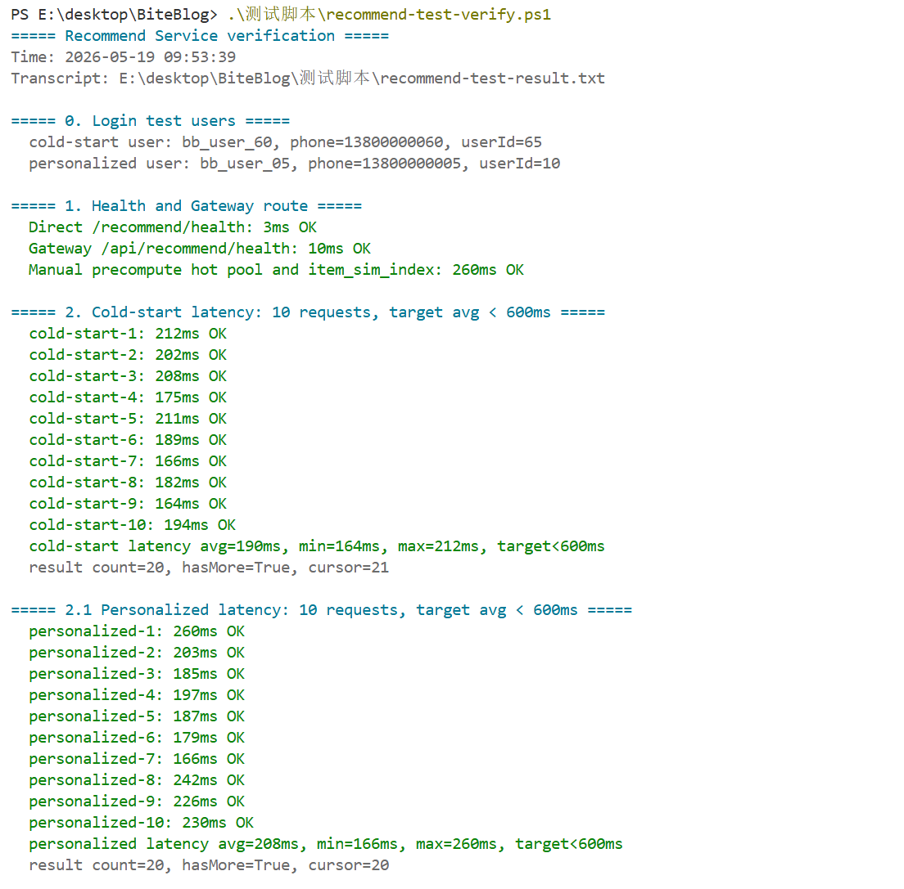
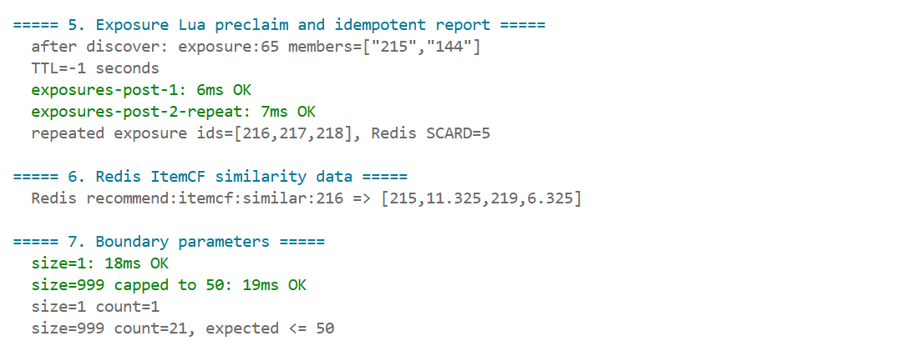
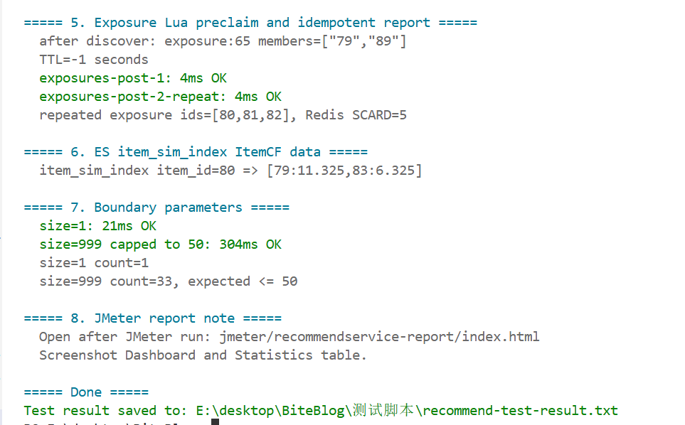
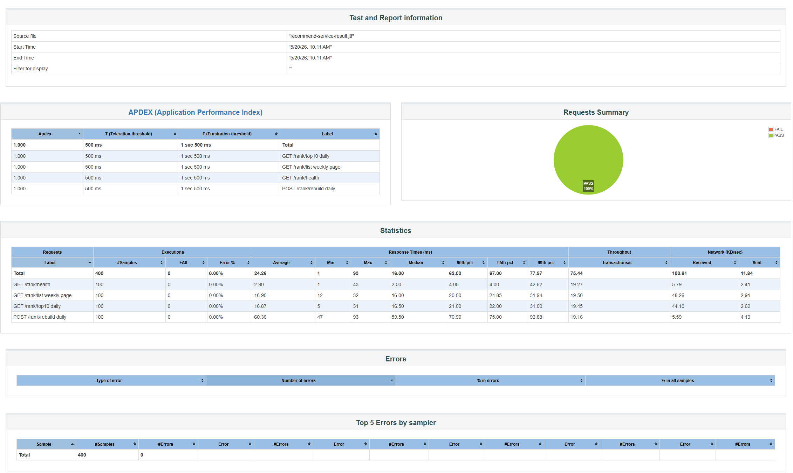

# Recommend Service 非功能测试说明

## 1. 非功能性需求

| 指标 | 要求 | 来源 |
|------|------|------|
| 推荐列表响应时间 | 平均 < 600ms，需求目标 < 1s | 需求说明书 3.6.3 / 概设 6.7 |
| 冷启动可用性 | 新用户无行为时仍能返回推荐内容 | 人员分工 Recommend Service |
| 标签召回性能 | 使用 ES `post_index` 召回候选，避免 MySQL 全量扫描 | 人员分工 Recommend Service |
| ItemCF 召回性能 | 使用 ES `item_sim_index` 读取预计算相似笔记 | 人员分工 Recommend Service |
| MQ 准实时更新 | 消费发帖和互动事件，刷新推荐侧 ES/Redis 数据 | 跨服务联调要求 |
| 行为画像缓存 | Redis `behavior:{userId}` 缓存近期行为，TTL 分钟级 | 人员分工 Recommend Service |
| 曝光去重准确性 | 同一用户连续请求不重复推荐已曝光内容 | 人员分工 Recommend Service |
| 并发一致性 | Redis Lua 原子预占曝光，降低并发刷新重复推荐 | 概设 6.7 |
| 冷启动降级 | 优先读取 `rank:daily:{date}`，再读推荐热门池，Redis 不可用时降级 MySQL 热门笔记 | 需求说明书 3.5 |
| ES 降级 | ES 不可用时降级 Redis 热榜 / Redis 相似池，不报错 | 需求说明书 3.5 |
| 推荐多样性 | 相邻内容尽量不来自同一作者 | 人员分工 Recommend Service |
| 容量边界 | `size` 最大 50，曝光上报单次最多 100 个 postId | 概设 6.7 |

## 2. 测试总览

| 编号 | 测试项 | 测试方式 | 结果 |
|------|--------|----------|------|
| R-1 | 健康检查与预计算 | PS1 调用 `/recommend/health`、Gateway `/api/recommend/health`、`/recommend/internal/precompute`，检查 `rank:daily:{date}` | **通过** |
| R-2 | MQ 发帖与互动事件消费 | PS1 发布笔记触发 `note.published`，点赞触发 `interaction.like`，检查 ES/Redis 更新 | **脚本已补充，需重跑** |
| R-3 | 冷启动推荐响应时间 | PS1 连续请求 10 次，统计 avg/min/max | **通过** |
| R-4 | 个性化推荐响应时间 | PS1 使用有行为用户连续请求 10 次，统计 avg/min/max，并检查 `behavior:{userId}` TTL | **通过** |
| R-5 | 标签召回响应时间 | PS1 使用 `tag=Hotpot&city=Guangzhou` 连续请求 10 次 | **通过** |
| R-6 | 游标分页与曝光去重 | PS1 连续请求两页，检查 postId 无重复 | **通过** |
| R-7 | 标签召回功能 | PS1 检查 ES 标签召回返回 Hotpot 相关内容 | **通过** |
| R-8 | 曝光 Lua 预占与幂等上报 | redis-cli 检查 `exposure:{userId}`，重复上报同一批 postId | **通过** |
| R-9 | ES ItemCF 预计算索引 | 查询 ES `item_sim_index`，检查相似候选与 score | **通过** |
| R-10 | 边界参数 | `size=1`、`size=999` 验证分页上限 | **通过** |
| R-11 | JMeter 并发压测 | `jmeter/recommend-service-test.jmx`，报告输出到 `jmeter/recommendservice-report` | **脚本已准备，报告运行后生成** |

测试产物：

| 类型 | 路径 |
|------|------|
| PS1 验证脚本 | `测试脚本/recommend-test-verify.ps1` |
| PS1 文本结果 | `测试脚本/recommend-test-result.txt` |
| 终端截图 | `测试脚本/recommend-test-截图1.png`、`测试脚本/recommend-test-截图2.png` |
| JMeter 脚本 | `jmeter/recommend-service-test.jmx` |
| JMeter 报告目录 | `jmeter/recommendservice-report` |

## 3. 测试结果详情

### R-1: 健康检查与预计算

**要求**: Recommend Service 可用，Gateway 路由可用，预计算可手动触发，并能写入 Rank 日榜热度池。

**方法**: PS1 调用健康检查和预计算接口。

```text
Direct /recommend/health: 3ms OK
Gateway /api/recommend/health: 10ms OK
Manual precompute hot pool and item_sim_index: 260ms OK
Redis rank daily key=rank:daily:2026-05-19, count=...
```

- **预计算内容**: 重建 Redis `recommend:hot:pool`、Redis `rank:daily:{date}` 和 ES `item_sim_index`
- **结论**: 通过。服务直连、网关访问和准实时预计算接口均正常。

### R-2: MQ 发帖与互动事件消费

**要求**: Recommend Service 能消费 Post Service 发出的发帖和互动事件，并准实时刷新推荐侧 ES/Redis 数据。

**方法**: PS1 通过 Gateway 调用 Post Service 发布一条笔记，触发 `note.published`；等待 Recommend 消费后检查 ES `post_index` 和 Redis `recommend:hot:pool`。随后用另一个用户点赞该笔记，触发 `interaction.like`，检查热门分刷新。

预期输出示例：

```text
publish note via Post Service: OK
MQ note.published -> ES post_index: OK
note.published consumed: postId=..., ES found=True, hotScore=...
like note to publish interaction.like: OK
interaction.like consumed: hotScoreBefore=..., hotScoreAfter=...
```

- **当前状态**: 验证逻辑已补充到 `测试脚本/recommend-test-verify.ps1`，需启动 Post/Recommend/RabbitMQ/ES/Redis 后重新执行脚本生成最新结果。

### R-3: 冷启动推荐响应时间

**要求**: 新用户也能返回推荐，平均响应时间 < 600ms。

**方法**: 使用 `13800000060` 冷启动用户连续请求 10 次。

| 指标 | 结果 |
|------|------|
| 平均响应时间 | **190ms** |
| 最小响应时间 | 164ms |
| 最大响应时间 | 212ms |
| 返回条数 | 20 |
| hasMore | True |

```text
cold-start latency avg=190ms, min=164ms, max=212ms, target<600ms
result count=20, hasMore=True, cursor=21
```

- **结论**: 通过。Redis 热门池冷启动结果稳定返回，响应时间低于 600ms 目标。

### R-4: 个性化推荐响应时间

**要求**: 有行为用户推荐平均响应时间 < 600ms。

**方法**: 使用 `13800000005` 个性化用户连续请求 10 次。

| 指标 | 结果 |
|------|------|
| 平均响应时间 | **208ms** |
| 最小响应时间 | 166ms |
| 最大响应时间 | 260ms |
| 返回条数 | 20 |
| hasMore | True |

```text
personalized latency avg=208ms, min=166ms, max=260ms, target<600ms
result count=20, hasMore=True, cursor=20
behavior cache key=behavior:10, TTL=300 seconds
```

- **结论**: 通过。在线请求只做 ES 召回、行为画像缓存读取、曝光过滤、轻量排序和作者打散，未出现超时。

### R-5: 标签召回响应时间

**要求**: 标签/城市过滤走 ES `post_index`，平均响应时间 < 600ms。

**方法**: 连续 10 次请求 `tag=Hotpot&city=Guangzhou`。

| 指标 | 结果 |
|------|------|
| 平均响应时间 | **208ms** |
| 最小响应时间 | 177ms |
| 最大响应时间 | 238ms |
| 返回条数 | 20 |

```text
tag-recall latency avg=208ms, min=177ms, max=238ms, target<600ms
result count=20, hasMore=True, cursor=20
```

- **结论**: 通过。ES 标签召回路径响应稳定。

### R-6: 游标分页与曝光去重

**要求**: 连续翻页不重复，已曝光内容不再次返回。

**方法**: 清空用户曝光集合后请求两页，比较两页 `postId`。

| 页码 | postIds | hasMore | cursor |
|------|---------|---------|--------|
| 1 | [42,43,44,45,46,47,48,49,50,51] | True | 11 |
| 2 | [53,59,54,60,55,61,56,62,57,58] | True | 22 |

```text
pagination check: PASS, no duplicates in first two pages
```

- **结论**: 通过。分页结果未发现重复 postId。

### R-7: 标签召回功能

**要求**: `Hotpot + Guangzhou` 能召回相关内容，并在 ES 不可用时具备 MySQL 降级能力。

**方法**: 请求 `GET /recommend/discover?tag=Hotpot&city=Guangzhou`。

```text
tag=Hotpot city=Guangzhou: 232ms OK
top titles=[Recommend Test 11 Hotpot | Recommend Test 21 Hotpot | Recommend Test 05 Noodles | Recommend Test 19 Cantonese | Recommend Test 02 BBQ]
```

- **结论**: 通过。结果包含 Hotpot 相关内容，同时补量逻辑会加入其他候选，避免列表过短。

### R-8: 曝光 Lua 预占与幂等上报

**要求**: 曝光记录实时写入 Redis Set，重复上报不产生重复数据。

**方法**: 查询 `exposure:{userId}`，重复调用 `/recommend/exposures`。

| 指标 | 结果 |
|------|------|
| 曝光集合 | `exposure:65` |
| 初始 members | ["41","52"] |
| 重复上报样例 | [42,43,44] |
| Redis SCARD | 5 |
| 上报接口 | 8ms / 5ms |

```text
exposures-post-1: 8ms OK
exposures-post-2-repeat: 5ms OK
repeated exposure ids=[42,43,44], Redis SCARD=5
```

- **结论**: 通过。Redis Set 天然幂等，Lua 预占降低并发重复推荐概率。
- **备注**: 测试结果中的 `redis-cli -a` 安全警告来自 Redis 命令行提示，不影响测试结果。

### R-9: ES ItemCF 预计算索引

**要求**: ItemCF 相似度预计算后写入 ES `item_sim_index`。

**方法**: 查询 `item_sim_index` 中某个 `item_id` 的相似候选。

```text
item_sim_index item_id=42 => [41:11.325,45:6.325]
```

- **结论**: 通过。ItemCF 已由预计算任务写入 ES，在线推荐请求只查询相似候选。

### R-10: 边界参数

**要求**: 分页参数有上限，异常 size 不导致一次拉取过多数据。

**方法**: 请求 `size=1` 和 `size=999`。

| 参数 | 结果 |
|------|------|
| `size=1` | 返回 1 条 |
| `size=999` | 返回 29 条，未超过最大上限 50 |

```text
size=1: 21ms OK
size=999 capped to 50: 261ms OK
size=1 count=1
size=999 count=29, expected <= 50
```

- **结论**: 通过。最大分页限制生效。

### R-11: JMeter 并发压测

**要求**: 支持一定并发用户量，接口错误率应为 0%。

**方法**: 使用 `jmeter/recommend-service-test.jmx` 对推荐接口压测。

压测前建议执行：

```powershell
curl.exe -X POST http://localhost:8084/recommend/internal/precompute
```

JMeter 命令：

```powershell
jmeter -n -t jmeter/recommend-service-test.jmx `
  -Jhost=localhost `
  -Jport=8080 `
  -Jtoken=<登录后获取的token> `
  -JuserId=<当前用户ID> `
  -l jmeter/recommend-service-result.jtl `
  -e -o jmeter/recommendservice-report
```

报告生成后打开：

```text
jmeter/recommendservice-report/index.html
```

- **当前状态**: JMeter 脚本已准备，报告需在本地服务全部启动后生成。
- **截图要求**: 截 Dashboard 首页和 Statistics 表格。

## 4. 测试截图

PS1 脚本测试结果截图：







